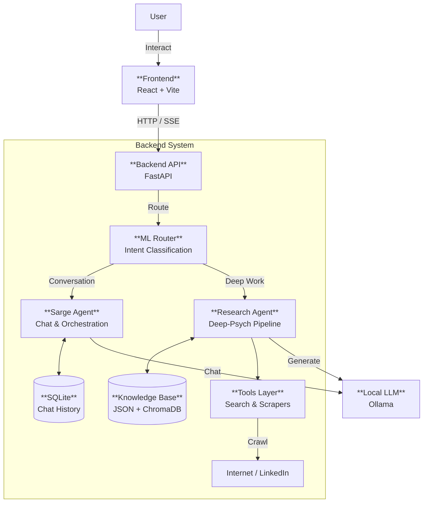
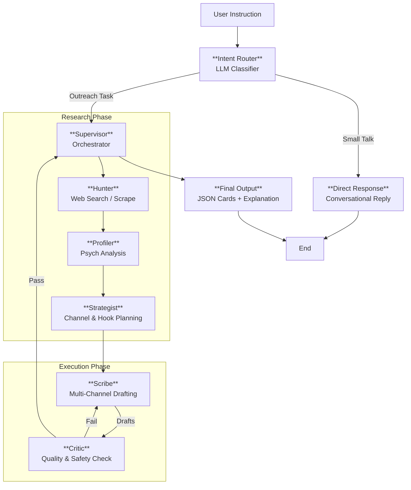

# Xenia26 Complete Project Architecture

This document provides a detailed architectural overview of the entire Xenia26 system, from the React frontend to the complex AI agent backend.

---

## 1. System High-Level Overview

Xenia26 is a local-first, AI-powered outreach automation platform. It combines a modern React frontend with a FastAPI backend that orchestrates multiple local LLMs (via Ollama) to research prospects, build psychological profiles, and generate personalized cross-channel messages.

---

## 2. Component Details

### 2.1 Frontend (`Frontend/`)
*   **Technology**: React, Vite, TailwindCSS.
*   **Role**: Provides the chat interface and card rendering for agent outputs.
*   **Key Components**:
    *   `ChatInterface`: Main streaming view. Handles Server-Sent Events (SSE) from the backend to display tokens and structured events (`phase` updates).
    *   `AgentCard`: Special UI components to render structured drafts (Email, LinkedIn, WhatsApp) returned by the agent, allowing users to copy/edit/send.
    *   `ThreadManager`: Manages conversation history sessions.

### 2.2 Backend (`fastapi/`)
*   **Technology**: FastAPI, Python 3.10+.
*   **Role**: API Gateway and Worker Host.
*   **Key Files**:
    *   `main.py`: App entry point, CORS config, static file serving.
    *   `ml/routes.py`: Defines endpoints like `/ml/agent/chat` (streaming) and `/ml/models`.
    *   `ml/infrastructure/db/sqlite.py`: Manages SQLite connection for persisting chat threads and message history.

### 2.3 ML Layer & Agents (`fastapi/ml/`)
This is the core intelligence layer, consisting of two distinct agent architectures.

#### A. Sarge Agent (`ml/application/sarge`)
*   **Type**: Real-time Conversational Router.
*   **Role**: The "Front Desk" agent. It handles small talk, answers questions about rules/capabilities, and routes complex requests to the Research Agent.
*   **Key Nodes**:
    *   `Router`: Decides `chat` vs `generate` vs `refine`.
    *   `ChatNode`: Handles conversational queries.
    *   `VoiceNode`: Uses XTTS (optional) for audio responses.
    *   `Editor`: Rapidly refines existing text without full research.

#### B. Research Agent ("Deep-Psych") (`ml/application/agent`)
*   **Type**: Batch-Processing Deep Work Agent.
*   **Role**: Executes the heavy lifting of prospecting, profiling, and drafting.
*   **Architecture**:
    *   **Intent Router**: (New) LLM-based gatekeeper that classifies intent and extracts the "Topic Lock".
    *   **Hunter**: Scrapes LinkedIn/Web for data using `DuckDuckGo` and custom crawlers.
    *   **Profiler**: Analyzes data to create a `PsychProfile` (DISC personality type, tone preferences).
    *   **Strategist**: (Updated) Infers optimal channels (including WhatsApp/SMS) and plans the angle/hook.
    *   **Scribe**: Generates drafts for all execution channels in parallel, enforcing strict 4-part email structure and creative personalization.
    *   **Critic**: Ruthless evaluator checking for Hallucinations, Instruction Adherence, Structure, and Personalization Depth.

### 2.4 Data Persistence
*   **SQLite**: Stores chat logs, threads, and user preferences.
*   **File System (JSON)**: Stores cached `ProspectProfile` and `PsychProfile` data to avoid redundant scraping/processing.
*   **ChromaDB**: (Optional/Partial) Vector store for internal RAG (Retrieval-Augmented Generation) of past successful outreach templates.

---

## 3. Detailed Agent Diagram (Research Pipeline)

This diagram focuses on the **Research Agent's** internal flow, which is the most complex part of the system.

## 4. Key Workflows

1.  **Smart Channel Inference**:
    *   User says: *"Reach out to him about the demo"*
    *   **Helpers.py**: Detects generic "reach out" -> hints `['email', 'linkedin_dm', 'whatsapp']`.
    *   **Strategist**: Sees hints + Context -> Selects Email, LinkedIn, and WhatsApp.
    *   **Scribe**: Generates 3 distinct drafts, each optimized for the platform (e.g., subject line for email, short casual text for WhatsApp).

2.  **Creative Personalization (Topic Lock)**:
    *   User says: *"Invite him to the AI summit"*
    *   **Intent Router**: Locks topic: *"Invitation to AI Summit"*.
    *   **Scribe**: allowed to use templates but MUST pivot to "AI Summit" immediately.
    *   **Critic**: Checks if the draft actually mentions "AI Summit". If not, creates feedback: *"Instruction Violation: Missing AI Summit ask"*. Scribe retries.

## 5. Technology Stack Summary

| Layer | specific Tech |
| :--- | :--- |
| **Frontend** | React 18, Vite, TailwindCSS, Axios, SSE |
| **Backend** | Python 3.10, FastAPI, Uvicorn, Pydantic |
| **AI Orchestration** | LangGraph (StateGraph), LangChain |
| **LLM Inference** | Ollama (local), interacting via `instructor` (for structured JSON) |
| **Database** | SQLite (Thread history), ChromaDB (Vector) |
| **Browsing** | `crawl4ai` concepts, unstructured headers spoofing |

---
*Generated by Antigravity on 2026-02-11.*
