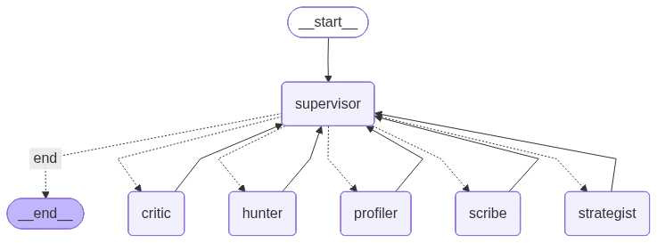

# Xenia26 - Cold Outreach Agent

Xenia26 is an advanced AI agent designed to automate and personalize cold outreach. It doesn't just "fill in templates"—it researches prospects, understands their psychology, plans a strategy, and drafts high-quality messages that get replies.

## How It Works (Simple Explanation)

Imagine a team of experts working for you 24/7. That's Xenia26.

1.  **You give it a Target**: A LinkedIn URL (e.g., `linkedin.com/in/jdoe`) and a Goal ("Sell our AI services").
2.  **The Agent gets to work**:
    -   🕵️ **The Hunter**: Visits the profile, reads their bio, posts, and articles to gather facts.
    -   🧠 **The Profiler**: Analyzes their writing style to understand their personality (e.g., "Direct and result-oriented" vs. "Friendly and chatty").
    -   ♟️ **The Strategist**: Decides the best way to approach them (e.g., "Send a short email focusing on ROI").
    -   ✍️ **The Scribe**: Writes the actual message, mimicking the prospect's communication style.
    -   ⚖️ **The Critic**: Reviews the draft. If it's too salesy or generic, it sends it back for revision.

## The Architecture (Hive Mind)

The agent uses a **"Hive Mind" (Supervisor-Worker)** architecture. Instead of a simple straight line, a central **Supervisor** brain coordinates specialized worker agents.



### Key Components

*   **Supervisor**: The brain. It decides what needs to be done next.
*   **Memory (Vector Store)**: The agent has a long-term memory. It remembers past successful emails and uses them as inspiration for new ones.
*   **Psych Profile Caching**: Once it analyzes a person, it remembers their personality forever to save time.
*   **Multi-Channel**: It can write Emails, LinkedIn DMs, and WhatsApp messages simultaneously.

## Getting Started

1.  **Install Dependencies**:
    ```bash
    uv sync
    ```

2.  **Run the Server**:
    ```bash
    uv run uvicorn ml.server:app --reload
    ```
