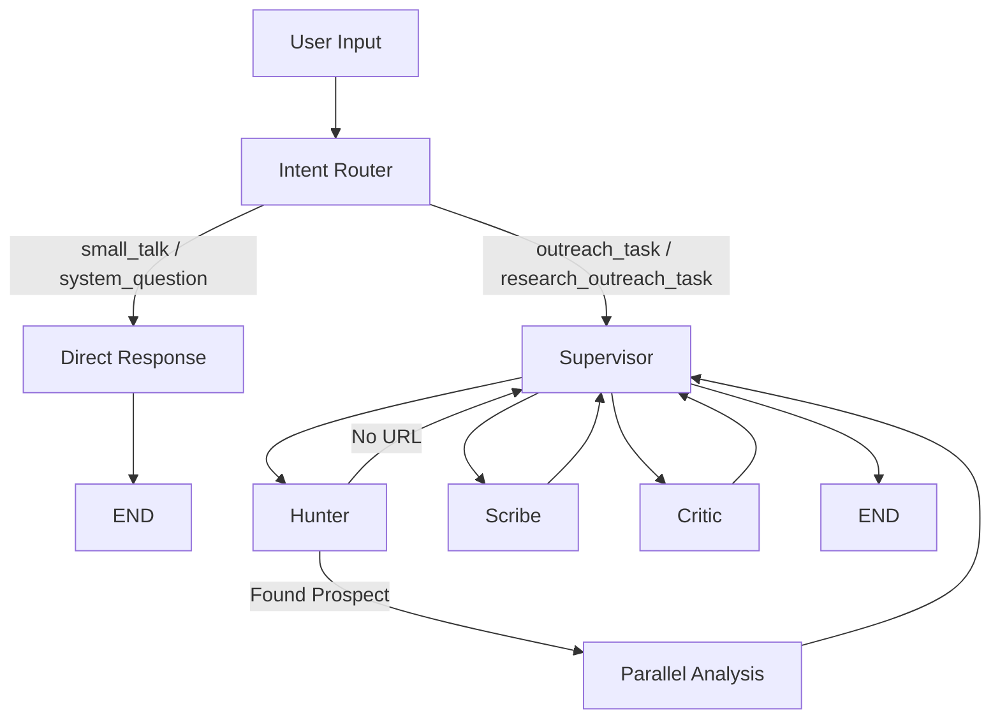

# Xenia26 Agent Architecture Documentation

Two agentic workflows built with **LangGraph**, served via **FastAPI**, powered by **Ollama**.

1.  **Research Agent ("Deep-Psych")**: Batch agent for deep lead research, profiling, and multi-channel outreach.
2.  **Sarge Agent**: Real-time conversational agent for chat and generation tasks.

**Location**: `fastapi/ml/application/`

---

## 1. Research Agent (`ml/application/agent`)

**Entry Point**: `run_agent` or `stream_agent` in [graph.py](file:///home/manas/Documents/Xenia26/fastapi/ml/application/agent/graph.py).

### 1.1 State Schema (`AgentState`)

Defined in [schemas.py](file:///home/manas/Documents/Xenia26/fastapi/ml/application/agent/schemas.py).

| Field | Type | Description |
|:---|:---|:---|
| `target_url` | `str?` | Prospect URL (LinkedIn, etc.) |
| `user_instruction` | `str` | User's goal/task |
| `prospect` | `ProspectProfile?` | Extracted lead data |
| `psych` | `PsychProfile?` | Inferred personality (DISC, tone, style rules) |
| `strategy` | `StrategyBrief?` | Outreach plan (channels, hook, goal) |
| `drafts` | `Dict[str, str]` | Generated content keyed by channel |
| `intent_category` | `str?` | `small_talk` / `system_question` / `outreach_task` / `research_outreach_task` |
| `topic_lock` | `str?` | Extracted primary topic (1 sentence) — enforced downstream |
| `search_keywords` | `List[str]` | Domain-only keywords for search (meta-language stripped) |
| `needs_search` | `bool` | Whether web search was determined necessary |
| `direct_response` | `str?` | Pre-built response for small_talk/system_question bypass |
| `logs` | `List[str]` | Execution log for UI transparency |

### 1.2 Workflow Graph

### 1.3 Nodes

#### Intent Router (`intent_router_node`) — **NEW**
- **File**: [intent_router.py](file:///home/manas/Documents/Xenia26/fastapi/ml/application/agent/intent_router.py)
- **Purpose**: Pre-Supervisor gate. Classifies intent, extracts topic lock, assesses search necessity.
- **LLM-driven**: Always uses LLM for intent classification and response generation.
- **Key functions**:
  - `classify_intent()` — 4-way classification + direct response generation
  - `extract_topic()` — strips meta-language, outputs domain keywords
  - `assess_knowledge_confidence()` — checks against `COMMON_TOPICS` (74 terms)

#### Direct Response (`direct_response_node`) — **NEW**
- Defined inline in [graph.py](file:///home/manas/Documents/Xenia26/fastapi/ml/application/agent/graph.py).
- Packages `direct_response` into `final_output` and ends the graph immediately.

#### Hunter (`hunter_node`)
- **Action**: Scrapes URLs or searches the web for prospect data.
- **Search behavior** (updated):
  - Uses `search_keywords` (domain-only) instead of raw instruction.
  - Skips search entirely when `needs_search=False` (high confidence in topic knowledge).
- **Tools**: `CrawlerDispatcher`, `duckduckgo_search`.

#### Profiler (`profiler_node`)
- Analyzes bio/activity → infers DISC type, communication style, style rules.

#### Strategist (`strategist_node`)
- Selects target channels, formulates hook/value prop/CTA.

#### Scribe (`scribe_node`)
- Generates drafts for all channels in parallel.
- **Topic Lock enforcement**: Injects `TOPIC_LOCK` constraint — every paragraph must reference the locked topic.
- **Creative Personalization**: Allows professional templates but enforces context infusion.
- **User instruction priority**: User's instruction is now the highest-priority input, above memory/cached patterns.

#### Critic (`critic_node`)
- Evaluates drafts against quality rubric.
- **Hallucination check** (new): Verifies all claims are grounded in prospect profile. Fails if fabricated data detected.
- **Personalization Check** (new): Checks if content feels generic or templated. Deducts 2 points if so.

### 1.4 Configuration

Defined in [config.py](file:///home/manas/Documents/Xenia26/fastapi/ml/application/agent/config.py).

| Constant | Purpose |
|:---|:---|
| `CHANNEL_TEMPS` | Per-channel temperatures (email: 0.5, linkedin/twitter: 0.55) |
| `CHANNEL_RULES` | Per-channel formatting constraints |
| `CHANNEL_MAX_TOKENS` | Per-channel token limits |
| `COMMON_TOPICS` | 74 well-known terms for knowledge confidence checks |
| `QUALITY_RUBRIC_TEXT` | Non-negotiable quality baseline for critic |

### 1.5 Structured Streaming Events

Defined in [streaming.py](file:///home/manas/Documents/Xenia26/fastapi/ml/application/agent/streaming.py). New `phase` event type:

| Event | Payload | When |
|:---|:---|:---|
| `intent_classified` | `{"category": "outreach_task"}` | After intent router |
| `topic_locked` | `{"topic": "Model drift in fraud detection"}` | After topic extraction |
| `search_decision` | `{"needs_search": false}` | After confidence check |

Existing types (`thought`, `tool_call`, `tool_result`, `response`, `done`) unchanged.

---
*Updated 2026-02-11 after refinement to replace template bans with creative personalization.*
