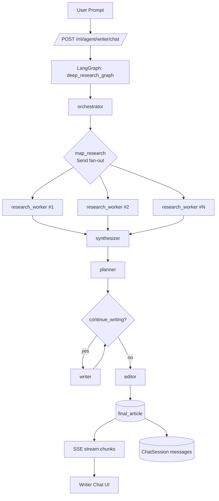
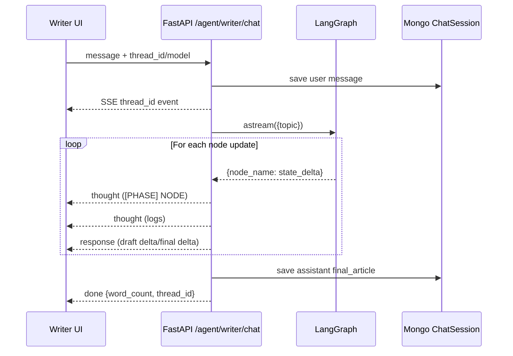

# Deep Research Agent (Digital Newsroom)

This document explains the `ollama_deep_researcher` agent implementation in detail.

## Architecture Diagram



### Runtime Streaming View



## Purpose

The deep research agent is a writer-focused, local-first pipeline that:

1. Breaks a user topic into focused research angles.
2. Runs parallel web research across those angles.
3. Synthesizes findings into a compact "Research Bible".
4. Plans an article outline.
5. Writes the article section-by-section in a loop.
6. Polishes the full draft in a final editing pass.

The output is streamed to the Writer UI through the `/ml/agent/writer/chat` endpoint.

## Files and Responsibilities

- `fastapi/ml/ollama_deep_researcher/state.py`
  - Defines typed graph state (`AgentState`, `WorkerState`).
- `fastapi/ml/ollama_deep_researcher/prompts.py`
  - System prompts for orchestrator, planner, writer, and editor.
- `fastapi/ml/ollama_deep_researcher/nodes.py`
  - Core node implementations and helper functions.
- `fastapi/ml/ollama_deep_researcher/graph.py`
  - LangGraph topology, routing logic, and compiled graph.
- `fastapi/ml/ollama_deep_researcher/configuration.py`
  - Runtime configuration model from env + `RunnableConfig`.
- `fastapi/ml/routes.py`
  - Streaming API route that executes this graph and streams SSE chunks.

## State Schema

Defined in `state.py`.

### `AgentState`

- `topic: str`
  - Main user request/topic.
- `sub_topics: List[str]`
  - Planned research angles generated by orchestrator.
- `gathered_notes: Annotated[List[str], operator.add]`
  - Parallel reducer target from workers.
- `research_bible: str`
  - Synthesized markdown of deduplicated research notes.
- `outline: List[Dict[str, Any]]`
  - Planned sections (`title`, `guidelines`, `word_count`).
- `current_section_index: int`
  - Cursor for the writer loop.
- `draft_sections: Dict[int, str]`
  - Per-section generated markdown.
- `final_article: str`
  - Final polished article after editor.
- `logs: Annotated[List[str], operator.add]`
  - Node log events for streaming "thoughts".

### `WorkerState`

- `sub_topic: str`
  - One research angle processed by a single worker.

## Graph Topology

Defined in `graph.py`.

```text
START
  -> orchestrator
  -> (fan-out via Send) research_worker x N
  -> synthesizer
  -> planner
  -> writer (loop until sections complete)
  -> editor
  -> END
```

### Routing Functions

- `map_research(state) -> List[Send]`
  - Creates one `Send("research_worker", WorkerState(...))` per sub-topic.
  - Uses fallback sub-topic if planner returns none.
- `continue_writing(state) -> str`
  - Returns `"writer"` while `current_section_index < len(outline)`.
  - Returns `"editor"` when all sections are drafted.

## Node-by-Node Behavior

Implemented in `nodes.py`.

### 1) `orchestrator(state, config)`

Role:
- Generates 3-5 sub-topics using JSON output mode.

How:
- Reads `state.topic`.
- Calls `ChatOllama` with `ORCHESTRATOR_PROMPT` (temperature `0.05`, `format="json"`).
- Parses model output with `_safe_json_loads`.
- Normalizes/fallbacks via `_coerce_sub_topics`.

Outputs:
- `sub_topics`, reset writing state fields (`current_section_index`, `draft_sections`, `final_article`), plus log line.

### 2) `research_worker(state, config)`

Role:
- Gathers compact web findings for one `sub_topic`.

How:
- Tries Tavily first (`_tavily_search`), falls back to DuckDuckGo (`_duckduckgo_search`).
- Formats top hits with `_format_web_results`.
- Builds markdown block:
  - `### <sub_topic>`
  - `- Web Findings: ...`

Outputs:
- One string in `gathered_notes` and a worker log.

### 3) `synthesizer(state)`

Role:
- Compiles all worker notes into a single normalized source document.

How:
- Deduplicates by exact note text.
- Produces markdown:
  - `# Research Bible`
  - `## Topic`
  - `## Investigative Notes`

Outputs:
- `research_bible` and a synthesis log.

### 4) `planner(state, config)`

Role:
- Converts `research_bible` into structured outline JSON.

How:
- Calls `ChatOllama` in JSON mode with `PLANNER_PROMPT` (temperature `0.05`).
- Validates/normalizes sections through `_normalize_outline`.
  - Ensures defaults for title/guidelines/word count.
  - Bounds `word_count` to `[120, 320]`.

Outputs:
- `outline`, resets `current_section_index`, plus planner log.

### 5) `writer(state, config)`

Role:
- Writes one section per pass; repeated by graph loop.

How:
- Reads `outline[current_section_index]`.
- Gets previous section tail via `_tail_sentences` for continuity.
- Sends only required context:
  - current section metadata
  - previous tail
  - full `research_bible`
- Calls `ChatOllama` with `WRITER_PROMPT` (temperature `0.2`).
- Ensures section starts with markdown `##` heading.

Outputs:
- Updates `draft_sections[index]`.
- Increments `current_section_index`.
- Emits writer progress log.

### 6) `editor(state, config)`

Role:
- Final cleanup and consistency pass over full draft.

How:
- Sorts `draft_sections` with `_sorted_section_items`.
- Joins into full draft.
- Calls `ChatOllama` with `EDITOR_PROMPT` (temperature `0.1`).
- Removes `<think>...</think>` tokens with `strip_thinking_tokens`.

Outputs:
- `final_article` and final word-count log.

## Prompt Design

Defined in `prompts.py`.

- `ORCHESTRATOR_PROMPT`
  - Editor-in-Chief persona.
  - Enforces structured JSON: `{"sub_topics":[...]}`
  - Includes contrarian requirement to improve depth.
- `WORKER_PROMPT`
  - Researcher persona with terse bullet intent.
  - (Current worker implementation uses tool calls/search functions directly; this prompt is available for future in-worker LLM summarization.)
- `PLANNER_PROMPT`
  - Architect persona.
  - Enforces JSON outline format and pattern-interrupt opening.
- `WRITER_PROMPT`
  - Journalist persona.
  - Section-scoped writing, continuity with previous section.
- `EDITOR_PROMPT`
  - Red-pen cleanup rules and banned-word filtering.

## Configuration Model

Defined in `configuration.py`.

`Configuration.from_runnable_config(...)` merges:

1. `RunnableConfig["configurable"]` values (request-level overrides)
2. Environment variables (`NAME.upper()`)

Main fields:

- `local_llm` (default: `llama3.2`)
- `ollama_base_url` (default: `http://localhost:11434/`)
- `search_api` (currently configurable, but worker currently prefers Tavily then DDG fallback directly)
- `max_web_research_loops` (available for future multi-iteration research loops)
- `fetch_full_page`
- `strip_thinking_tokens`
- `use_tool_calling`

## Streaming Integration (Backend API)

Implemented in `fastapi/ml/routes.py` at `/agent/writer/chat`.

Flow:

1. Validate deep-research graph is importable (`_ensure_deep_research_loaded`).
2. Save user message to thread.
3. Start SSE stream and emit initial `thread_id`.
4. Execute `deep_research_graph.astream({"topic": request.message}, config=config)`.
5. For each graph update:
   - emit phase events: `[PHASE] ORCHESTRATOR`, etc.
   - emit `logs` as `thought` events.
   - emit incremental article deltas from `draft_sections` and `final_article`.
6. Persist final assistant article in DB.
7. Emit `done` with metadata (`thread_id`, `writer_mode`, `word_count`).

SSE chunk types used:

- `thought`
- `response`
- `done`
- `error`

## Reliability and Fallbacks

- Search fallback:
  - Tavily unavailable/failing -> DuckDuckGo.
- JSON robustness:
  - `_safe_json_loads` strips code fences and invalid wrappers.
- Outline fallback:
  - `_normalize_outline` generates seeded sections when planning output is invalid.
- Final result fallback:
  - If streaming misses final text, route calls `graph.ainvoke(...)` once to recover.
- Token hygiene:
  - `strip_thinking_tokens` removes chain-of-thought markers from user-visible output.

## Performance Characteristics

- Parallel research fan-out uses LangGraph `Send` API.
- Writer loop is sequential by design for continuity.
- SSE streams partial article as each section lands, reducing perceived latency.
- Temperatures are tuned by role:
  - low for planning/orchestration,
  - slightly higher for writing,
  - low for editing consistency.

## How to Extend Safely

1. Add citation objects:
   - Include `source_url` and confidence in worker output.
2. Add a critic node:
   - Validate factual consistency and section-level constraints before editor.
3. Add style profiles:
   - Inject style presets from Writer Studio fields into planner/writer prompts.
4. Add domain adapters:
   - Keep core graph generic; add optional domain-specific prompt adapters, not hardcoded context in state.
5. Add looped research depth:
   - Use `max_web_research_loops` to perform additional targeted searches before planner.

## Quick Debug Checklist

If output quality is poor:

1. Verify Ollama model is available and responsive.
2. Check Tavily/DDG connectivity and returned snippets.
3. Inspect streamed `thought` logs for failing node.
4. Verify outline validity in planner output.
5. Confirm writer receives non-empty `research_bible`.
6. Check editor did not over-trim content.
